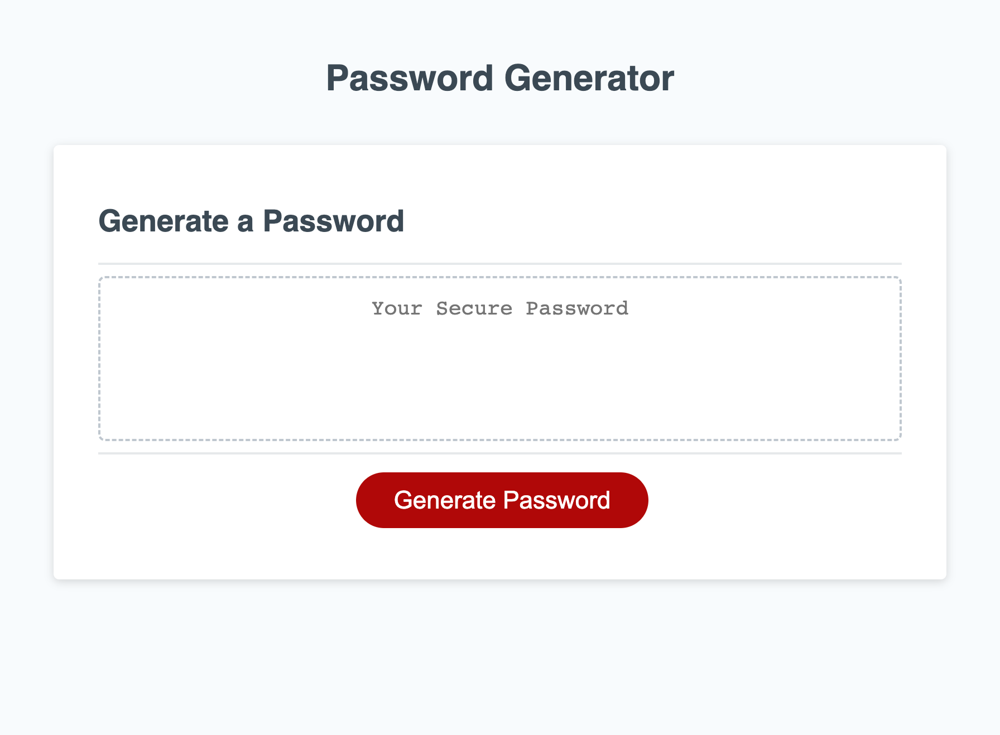

# Password Generator Starter Code

## Description

This webpage is a refactored starter code. The purpose for this refactoring is to make the functionality of the javascript file efficient. Generating a multitude of different passwords for employee security, this combines numbers, letters (uppercase and lowercase) and characters. This file was made using CSS HTML and Javascript.

Webpage: https://keiras1.github.io/password-generator/

## Usage

This webpage is used to generate passwords, it can be very helpful in any setting that may require security. This may include personal accounts as well as work related accounts that need a more secure level of privacy. You may generate as many passwords as you would like. There are certain criteria you must allow for, in order for a password to be generated. If you do not click  at least one of the criteria a password cannot be generated. Feel free to choose a password ranging from 8 to 128 digits long with a combination of  different values you can choose to use.

## Credit 

Starter code from "Xandromus" https://github.com/coding-boot-camp/friendly-parakeet .

## License
Refer to license in repo